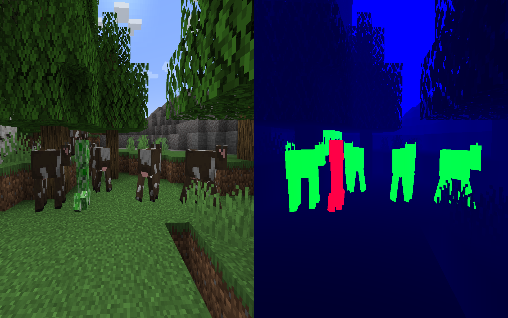

# Segmentation Shader

A shader to quickly aide the creation of datasets.

## Requirements

- Minecraft with [Iris](https://github.com/IrisShaders/Iris)

## Description

> 
> This is subject to change to add more bitplanes in trade of resolution, it is only stated here for documentation purposes!

After activating the shader, disabling the GUI splits the screen into two halves: the first half shows the normal Minecraft view, while the right half shows mob/entities coloring.

Currently, the R channel is set to 1 if the entity is a hostile one, the G channel when it is a friendly one. The blue channel is for now reserved for depth, just in case we might need it in the future.

## Resources

| Link | Description |
| - | - |
| [shaderLABS/Base-330](https://github.com/shaderLABS/Base-330) | The starting point/boilerplate that was used to create this shader
| [shaders.properties](https://shaders.properties/) | General documentation of available attributes/uniforms/buffers.
| [onnowhere/core_shaders](https://github.com/onnowhere/core_shaders) | "Magic Vectors" for `Light{0,1}_Direction` values to replicate Vanilla entity lighting