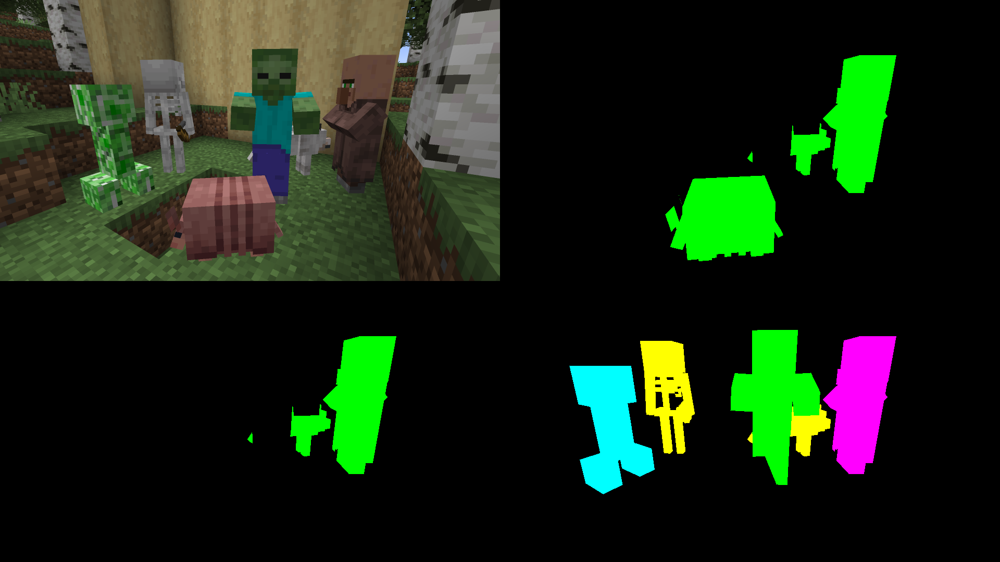

# Segmentation Shader

A shader to quickly aide the creation of datasets.

## Requirements

- Minecraft with [Iris](https://github.com/IrisShaders/Iris)
- `node`

## Usage

1. Run `node minecraft_shader/generate_entityprop.js`
2. Copy or link `minecraft_shader` to `.minecraft/shaderpacks`
3. Activate the shader by holding a Spider Eye or disable GUI

## Description



After activating the shader, the screen will split into *four* quadrants.

The first quadrant shows the normal RGB view. Due to the sampling/filtering internally used within Minecraft, it will always act as it has MSAAx2 anti-aliasing.

The second, third and fourth quadrant are *individual bit-planes* making up a 9-bit buffer. Using those, you can calculate the individual IDs (assigned by the `generate_entityprop.js` and its result `entities.json`) of the entities on the screen.

> **Example**
> 
> Going from left-to-right, top-to-bottom, the bit-planes will be labeled A, B, C. The ID of the entities is the calculated like this:
> ```js
> const id = (
>   A.r << 8 + 
>   A.g << 7 + 
>   A.b << 6
> ) + (
>   B.r << 5 + 
>   B.g << 4 + 
>   B.b << 3
> ) + (
>   C.r << 2 + 
>   C.g << 1 + 
>   C.b << 0
> );
> ```
> So, for example the Zombie would be `0b000_000_010`, which would equate to `2`.\
> A villager would be `0b010_010_101`, which is `149`.\
> A skeleton would be `0b000_000_110`, which is `6`.\
> A creeper would be `0b000_000_011` which is `3`.
>
> (*Note: these specific IDs are examples only, use `entities.json`!!*)


## Limitations

NVIDIA GPUs, on both Linux and Windows, for some reason does not clear the GBuffers between renders, which is why the output of those GBuffers individual channels are binary. For most cases this should be *fine*, since we'd seldom encounter a texture which maxes out a given channel.

The only issue that I've found is if the player has Night Vision effect on them, which they should avoid during dataset creation.

## Resources

| Link | Description |
| - | - |
| [shaderLABS/Base-330](https://github.com/shaderLABS/Base-330) | The starting point/boilerplate that was used to create this shader
| [shaders.properties](https://shaders.properties/) | General documentation of available attributes/uniforms/buffers.
| [onnowhere/core_shaders](https://github.com/onnowhere/core_shaders) | "Magic Vectors" for `Light{0,1}_Direction` values to replicate Vanilla entity lighting